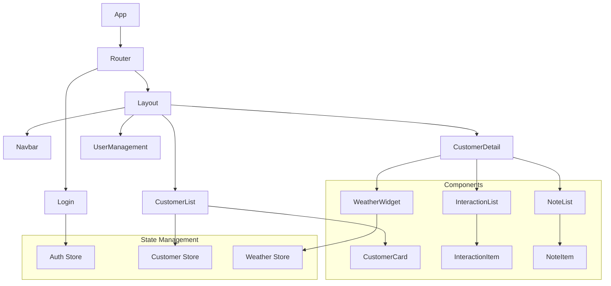

# Component Structure Diagram

```mermaid
graph TD
    App --> Router
    Router --> Layout
    Router --> Login

    Layout --> Navbar
    Layout --> CustomerList
    Layout --> CustomerDetail
    Layout --> UserManagement

    CustomerList --> CustomerCard
    CustomerDetail --> InteractionList
    CustomerDetail --> NoteList
    CustomerDetail --> WeatherWidget

    subgraph "Components"
        CustomerCard
        InteractionList --> InteractionItem
        NoteList --> NoteItem
        WeatherWidget
    end

    subgraph "State Management"
        AuthStore[Auth Store]
        CustomerStore[Customer Store]
        WeatherStore[Weather Store]
    end

    Login --> AuthStore
    CustomerList --> CustomerStore
    WeatherWidget --> WeatherStore
```