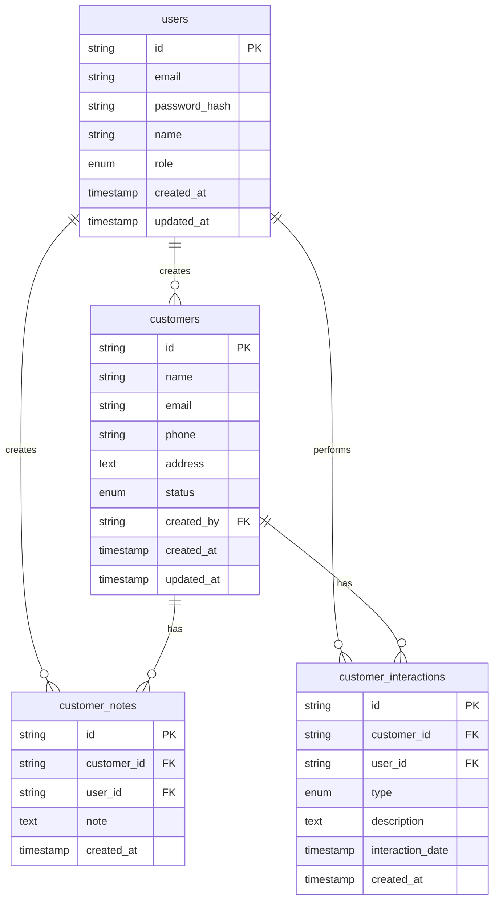

# Database Schema Diagram

```mermaid
erDiagram
    users {
        string id PK
        string email
        string password_hash
        string name
        enum role
        timestamp created_at
        timestamp updated_at
    }
    
    customers {
        string id PK
        string name
        string email
        string phone
        text address
        enum status
        string created_by FK
        timestamp created_at
        timestamp updated_at
    }
    
    customer_notes {
        string id PK
        string customer_id FK
        string user_id FK
        text note
        timestamp created_at
    }
    
    customer_interactions {
        string id PK
        string customer_id FK
        string user_id FK
        enum type
        text description
        timestamp interaction_date
        timestamp created_at
    }

    users ||--o{ customers : "creates"
    users ||--o{ customer_notes : "creates"
    users ||--o{ customer_interactions : "performs"
    customers ||--o{ customer_notes : "has"
    customers ||--o{ customer_interactions : "has"
```