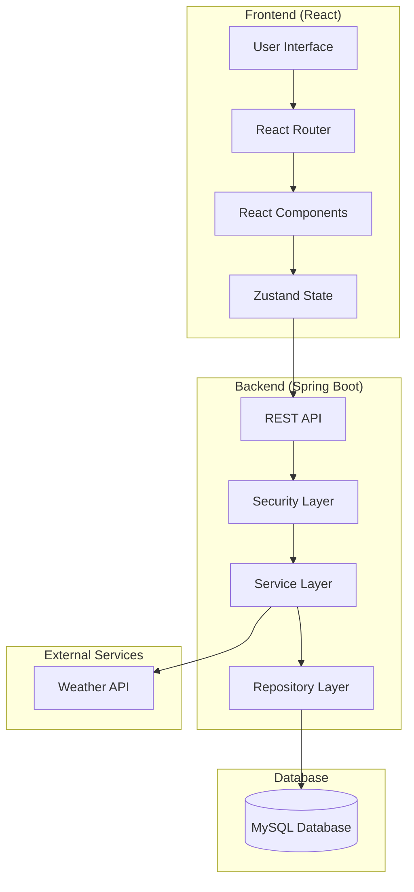
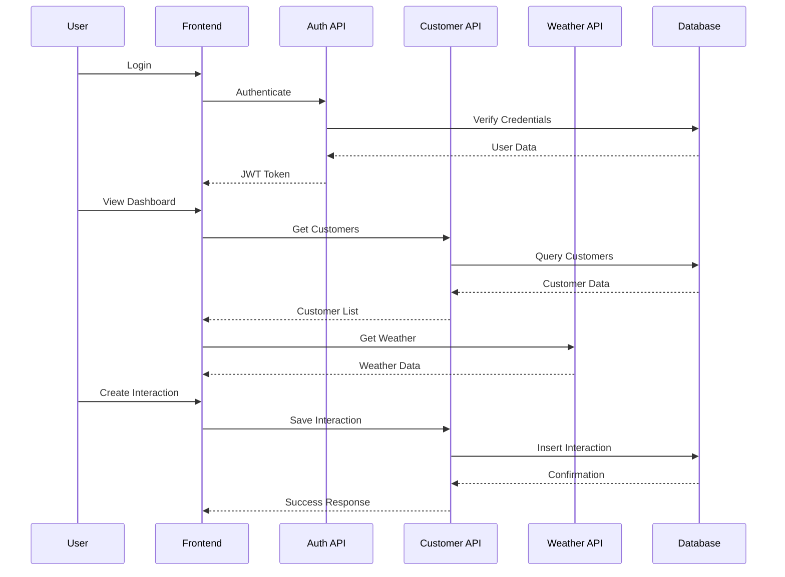

# System Architecture Diagram

```mermaid
graph TB
    subgraph "Frontend (React)"
        UI[User Interface]
        Router[React Router]
        State[Zustand State]
        Components[React Components]
    end

    subgraph "Backend (Spring Boot)"
        API[REST API]
        Security[Security Layer]
        Service[Service Layer]
        Repository[Repository Layer]
    end

    subgraph "External Services"
        Weather[Weather API]
    end

    subgraph "Database"
        MySQL[(MySQL Database)]
    end

    UI --> Router
    Router --> Components
    Components --> State
    State --> API
    API --> Security
    Security --> Service
    Service --> Repository
    Service --> Weather
    Repository --> MySQL
```

```mermaid
sequenceDiagram
    participant U as User
    participant F as Frontend
    participant A as Auth API
    participant C as Customer API
    participant W as Weather API
    participant DB as Database

    U->>F: Login
    F->>A: Authenticate
    A->>DB: Verify Credentials
    DB-->>A: User Data
    A-->>F: JWT Token

    U->>F: View Dashboard
    F->>C: Get Customers
    C->>DB: Query Customers
    DB-->>C: Customer Data
    C-->>F: Customer List

    F->>W: Get Weather
    W-->>F: Weather Data

    U->>F: Create Interaction
    F->>C: Save Interaction
    C->>DB: Insert Interaction
    DB-->>C: Confirmation
    C-->>F: Success Response
```